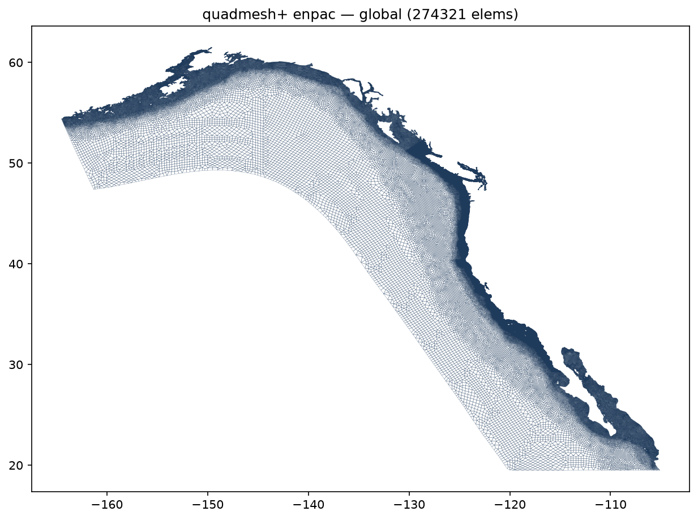
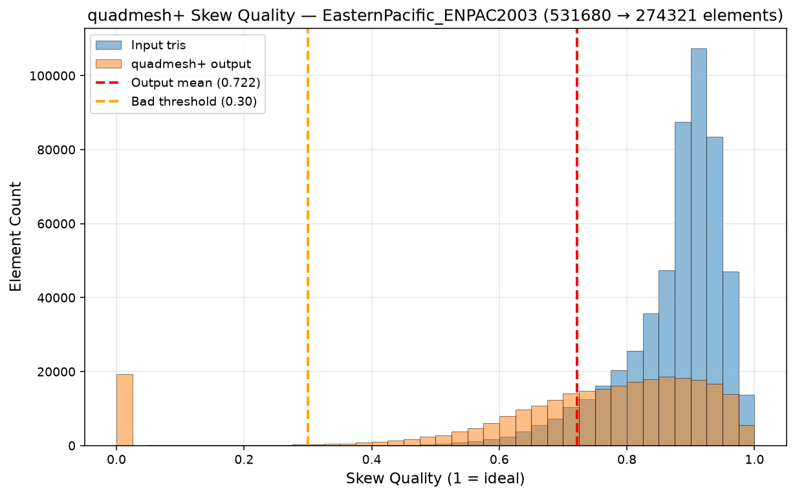
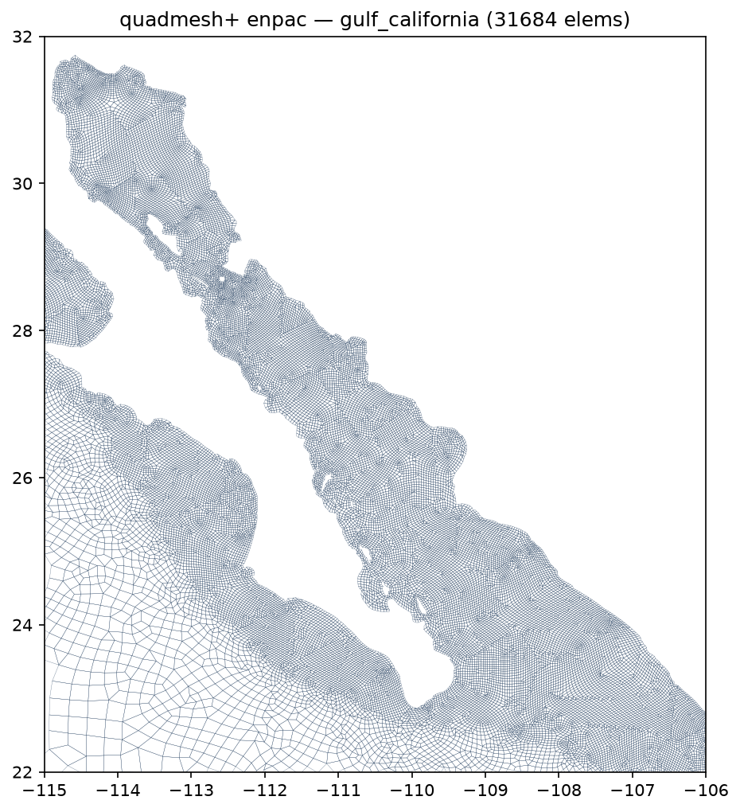

<h1 align="center">
  
</h1>

<p align="center">
  <strong>A Quadrangular ADvanced, automatic unstructured MESH generator for 2D shallow-water models.</strong><br>
  Python API and port of the MATLAB library and 'QuADMESH+' <a href="https://github.com/user-attachments/files/19724263/QuADMESH-Thesis.pdf">
    </a> 
</p>

<p align="center">
  <strong><a href="https://scholar.google.com/citations?user=IBFSkOcAAAAJ&hl=en">Dominik Mattioli</a><sup>1†</sup>, <a href="https://scholar.google.com/citations?user=mYPzjIwAAAAJ&hl=en">Ethan Kubatko</a><sup>2</sup></strong><br>
  <sup>†</sup>Corresponding author | <sup>1</sup>Unaffiliated | <sup>2</sup>Ohio State University (<a href="https://ceg.osu.edu/computational-hydrodynamics-and-informatics-laboratory"></a>)
</p>

> **Attention MATLAB users:** This Python library is the actively-developed successor to the original MATLAB codebase. The original code (no longer maintained) is frozen under [`src/matlab/quadmesh`](https://github.com/domattioli/QuADMESH/tree/main/src/matlab/quadmesh).

---

<p align="center">
  <a href="https://pypi.org/project/quadmesh/"></a>
  <a href="https://www.python.org/downloads/"></a>
  <a href="https://github.com/domattioli/QuADMESH/actions/workflows/tests.yml"></a>
  <a href="https://github.com/domattioli/QuADMESH/issues"></a>
  <a href="https://doi.org/10.5281/zenodo.20351165"></a>
  <a href="LICENSE"></a>
</p>

## Table of Contents

- [Status & Roadmap](#status--roadmap)
- [Installation](#installation)
- [Repository Layout](#repository-layout)
- [Quick Start](#quick-start)
- [Performance](#performance)
- [Citation](#citation)
- [Related Projects](#related-projects)
- [Contact](#contact)
- [License](#license)

---

## Status & Roadmap

**Current status (June 2026): Work-in-Progress, but mostly functional.
** the QuADMESH+ layer-ordered tri-to-quad conversion is implemented and is the default `method="quadmesh+"`. The interior-saturating per-layer sweep (thesis Ch 4.1 IE-before-OE, Ch 4.2 fold-seam forbiddance) leaves **zero interior residual triangles by construction** — the faithfulness invariant. Post-process mean element quality needs improvement (degen. elements on the boundary).

- **Now:** edge-case fixups (isolated-triangle edge-swap; boundary-layer walkability) and quality tuning.
- **Next:** enhanced pre- and post-processing for quality improvement; performance optimization; evaluate a C++ or Rust backend; wire `tri2quad(aggressive=)` to CHILmesh `merge_elements`.
- **Future:** formal integration within a unified ecoystem including <a href="https://github.com/domattioli/ADMESH"></a> and <a href="https://github.com/domattioli/CHILmesh"></a>

---

## Installation

Alpha build
```bash
pip install quadmesh
```

```bash
# From the repo root (src-layout package)
pip install -e .            # Basic install
pip install -e ".[dev]"     # + pytest for the test suite
pip install -e ".[plot]"    # + matplotlib for quality plots
```

Test the installation:

```bash
pytest -q                          # 169 tests (101 run offline; mesh-dependent
                                   # tests need a Valence PAT — see tests/fixtures/README.md)
python -m quadmesh.cli in.14 -o out.14
```


---

## Repository Layout

```
src/quadmesh/       Python package (the maintained implementation)
tests/              pytest suite; tests/fixtures/meshes/ holds .14 test meshes
docs/               MAPPING.md (MATLAB → Python), session notes
specs/              speckit specs/plans/tasks
videos/             demo assets (quadmesh_logo.gif, render scripts)
src/matlab/         frozen legacy MATLAB reference (read-only, not installable)
archive/            in-repo holding pen: upstream dups, .mat binaries, old results
```

**Note on CHILmesh:** Functionality is **not vendored** — it is an external dependency (`chilmesh>=0.4.0`). The old MATLAB `@CHILmesh` class lives under `archive/` for historical reference only; see [CHILmesh](https://github.com/domattioli/CHILmesh).

---

## Quick Start

Convert a triangular `fort.14` mesh to quad-dominant with the default QuADMESH+ method:

```bash
python -m quadmesh.cli input.14 -o output.14
```

Useful flags: `--polygon domain.poly` (supply the domain boundary), `--no-post-process` (skip the quality smoother), `--n-smooth-iter N` (smoother iterations). Run `python -m quadmesh.cli --help` for the full list.

See [MAPPING.md](docs/MAPPING.md) for the MATLAB → Python function correspondence and current port status.

---

## Performance

On the largest mesh in the [Valence](https://github.com/domattioli/Valence) registry — `ENPAC2003`, the Eastern North Pacific tidal grid of **531,680 triangles across 272,913 nodes** — QuADMESH+ returns a fully quadrilateral mesh of **274,321 quadrilaterals with zero interior residual triangles** (the faithfulness invariant) in **773 s (12.9 min)**, single-threaded, on the `chilmesh` 1.0.0 backend.

<p align="center">
  
</p>

### Phase timing

Single run, single thread, measured at QuADMESH 0.1.0 with the `chilmesh` 1.0.0 backend. The post-process stage — doublet collapse, boundary cleanup, and the FEM smoother — dominates the wall-clock budget; the layer-ordered tri-to-quad sweep is the second cost.

| Phase | Time (s) | Share |
|---|---|---|
| Load + half-edge initialization | 33.9 | 4.4% |
| `create_quad_domain` | 15.0 | 1.9% |
| `tri2quad_routine` (layer-ordered sweep) | 186.8 | 24.2% |
| `post_process_routine` (collapse + cleanup + FEM smooth) | 537.6 | 69.5% |
| **Total** | **773.3** | **100%** |

### Element quality

Skew quality on the unit interval (1 = an ideal square; the `chilmesh` `element_quality(metric="skew")` metric), reported before (input triangles) and after (output quadrilaterals).

<p align="center">
  
</p>

| Metric | Input triangles | Output quads |
|---|---|---|
| Mean | 0.875 | 0.722 |
| Median | 0.897 | 0.783 |
| Minimum | 0.150 | 0.000 |
| Std. dev. | 0.081 | 0.241 |
| Fraction below 0.30 | 0.0% | 7.6% |

Recombining two triangles into one quadrilateral trades a measurable amount of per-element quality (mean skew 0.875 → 0.722) for the element-count halving and the all-quad topology. The sub-0.30 tail is **7.6%** of elements and is **near-exclusively a boundary-layer artifact**: skeletonization layer 0 — the boundary band — carries 20,888 of the 20,918 low-quality quads at a 20.5% bad-rate and a mean skew of 0.552, while every interior layer (1 and inward) holds at mean skew ≥ 0.80, rising monotonically to 0.967 at the innermost layer. Of the low-quality quads, 93.0% touch the domain boundary along **two or more edges** — the near-degenerate boundary-following quads that the FEM smoother cannot relax because their nodes are pinned to the boundary. The Gulf of California subset below shows the regular interior quads against this thin boundary band:

<p align="center">
  <br>
  <em>QuADMESH+ output over the Gulf of California (subset of the ENPAC2003 domain).</em>
</p>

The boundary-layer quality limitation is tracked in [#90](https://github.com/domattioli/QuADMESH/issues/90); both measurements above are reproducible from the repository:

```bash
# per-phase timing + quality histogram for any fort.14 mesh
python scripts/bench_quadmesh_plus.py --mesh path/to/mesh.14

# classify low-quality quads by mesh layer and boundary contact
python scripts/diagnose_bad_quads.py --mesh path/to/mesh.14 --tag mymesh
```

---

## Citation

**Algorithm & theory** (cite the original thesis):

> Mattioli, DO (2017). QuADMESH+: A Quadrangular ADvanced Mesh Generator for Hydrodynamic Models. The Ohio State University, OhioLINK - Electronic Theses and Dissertations Center. Master's Thesis. http://rave.ohiolink.edu/etdc/view?acc_num=osu1500627779532088

**This software** (cite the Zenodo release):

> Mattioli, DO, Kubatko, EJ (2026). QuADMESH: A Quadrangular ADvanced, automatic unstructured MESH generator for 2D hydrodynamic domains. Zenodo. https://doi.org/10.5281/zenodo.20351165

The DOI `10.5281/zenodo.20351165` resolves to the latest release; version-specific DOIs are listed on the [Zenodo record](https://doi.org/10.5281/zenodo.20351165).

<!-- TODO: Add CITATION.cff at repo root once port reaches v1.0.0; will enable GitHub's "Cite this repository" button and Zotero integration -->

---

## Related Projects

- **[ADMESH](https://github.com/domattioli/ADMESH)** — Python port of the ADMESH adaptive mesh generator with pythonic API.
- **[CHILmesh](https://github.com/domattioli/CHILmesh)** — Mesh data structure, smoother, and quality analysis for triangular and quadrilateral meshes.

---

## Contact

**Dominik Mattioli** (repo owner) — [GitHub](https://github.com/domattioli)  
**Ethan J. Kubatko** — [kubatko.3@osu.edu](mailto:kubatko.3@osu.edu)

---

## License

**Noncommercial / research use only.** Licensed under the PolyForm Noncommercial License 1.0.0 **with an additional No-AI/ML-training restriction** — see [LICENSE](LICENSE) and [AI-USAGE.md](AI-USAGE.md).

No commercial use and no use as AI/ML training data without a separate written license. Commercial or AI-training licenses: contact domattioli via mango-kooky-okay@duck.com

---

<p align="center">
  <sub>Regenerate logo GIF: <code>python videos/scripts/render_logo_gif.py</code> (matplotlib only, no ffmpeg).</sub>
</p>
