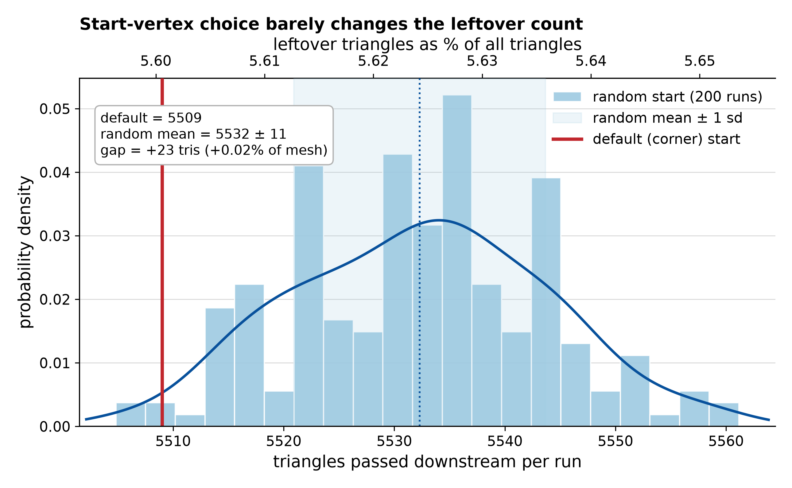
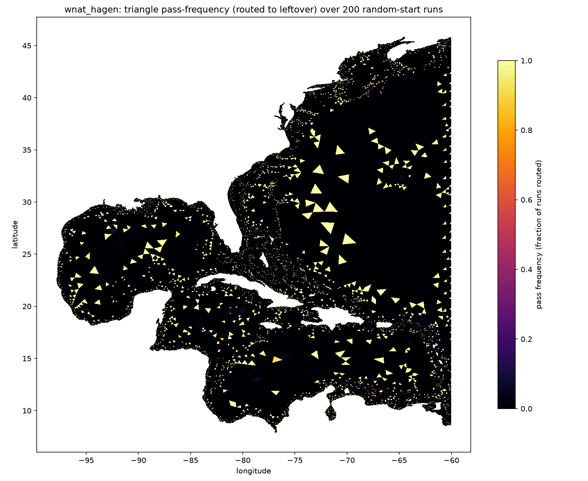
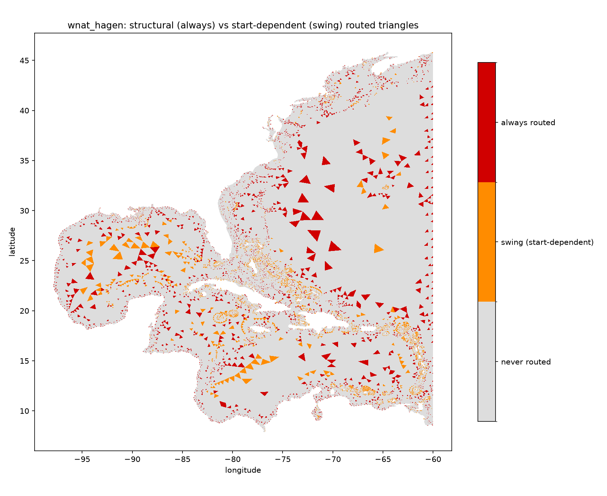
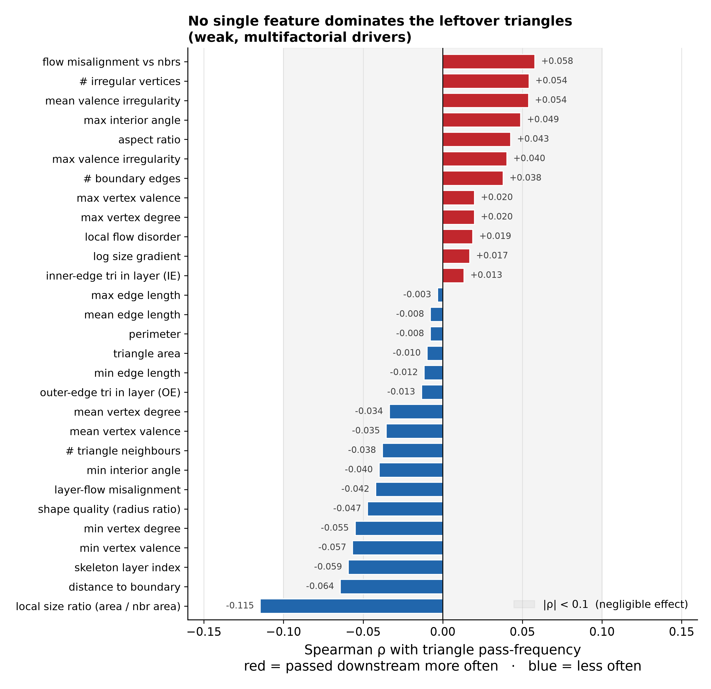
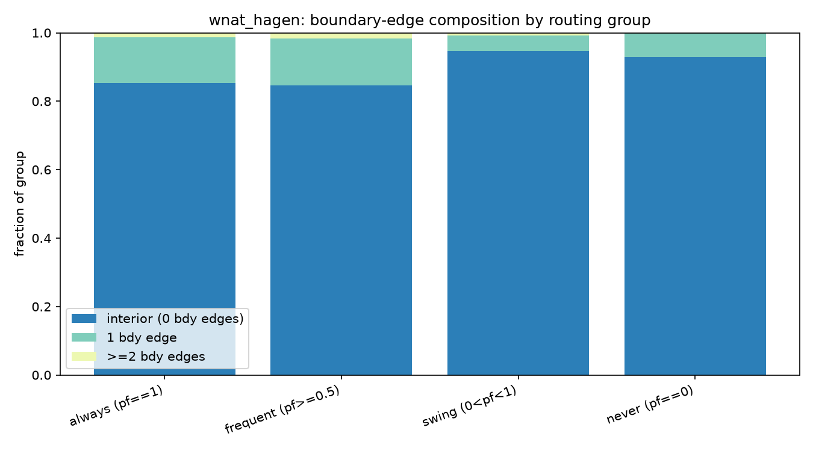

# Monte-Carlo layer-pass study — WNAT_Hagen

Which triangles does the QuADMESH+ per-layer sweep leave over (route to
`route_leftover_tri` instead of merging into a quad within their layer), and
why? Fewer leftovers yield a more quad-pure mesh, so the leftover set marks the
problem areas.

**Headline:** randomizing the per-layer walk-start vertex does *not* reduce the
leftover count (5,532 ± 11 triangles per run across 200 random starts; the
deterministic corner start, 5,509, is already below the random mean). About half
the leftovers are structural (routed in every run) and half are start-dependent;
no single mesh feature explains them (max |Spearman ρ| = 0.115).

## Method

- **Knob.** `identify_edges._START_INDEX_SELECTOR` makes the every-other-edge
  walk (`identifyEdgesFun_v2`, thesis Ch 4.1) start at a random path vertex
  instead of the first outer corner; the path is rotated to start just after the
  chosen vertex (same convention as the default). Default output is byte-identical
  when the hook is unset, and the zero-interior-residual faithfulness invariant
  holds.
- **Signal.** A `trace` dict in `_quadmesh_plus_per_layer` records merged-vs-routed
  triangle ids per layer. Per-triangle **pass-frequency (PF)** = fraction of runs
  in which a triangle is routed.
- **Run.** 200 random starts on WNAT_Hagen (98,365 elements, 52,774 vertices,
  30 layers), 4-way parallel.

## Results

| quantity | value |
|---|---|
| triangles routed per run | 5,532 ± 11 (min 5,505, max 5,561) |
| default corner-start total | 5,509 (23 below random mean) |
| ever routed (PF > 0) | 9,743 (9.9%) |
| always routed (PF = 1) | 4,854 (4.9%) |
| structural fraction of leftovers | 49.8% |
| always-routed clustering ratio | 0.42 (anti-clustered) |

### 1. The start vertex is not a lever
The per-run total spans 56 triangles (1.0%) over 200 starts and the corner start
already beats the random mean. Start selection cannot meaningfully cut leftovers.



### 2. Half structural, spatially scattered
4,854 triangles are always routed; they are anti-clustered (neighbour-coincidence
0.021 vs 0.049 baseline), i.e. dispersed point defects, not bands. Always-routed
triangles are mostly outer-edge (OE, 71%) with 2× the boundary-edge incidence of
never-routed; swing triangles are mostly inner-edge (IE, 74%) in shallow outer
layers near the boundary.




### 3. No single driver; valence, size transitions, flow each contribute weakly
All single-feature correlations are weak. Ranked (Spearman ρ):

| feature | ρ | reading |
|---|---|---|
| local size ratio (area ÷ nbr area) | −0.115 | smaller-than-neighbour (fine side of an ADmesh size transition) → routed more |
| distance to boundary | −0.064 | nearer the boundary → routed more |
| skeleton-layer index | −0.059 | shallower (outer) layers → routed more |
| flow misalignment vs neighbours | +0.058 | local orientation incoherence → routed more |
| min vertex valence | −0.057 (Pearson −0.097) | low-valence vertex → routed more |
| # irregular vertices | +0.054 | valence defects → routed more |
| mean valence irregularity \|v−6\| | +0.054 | valence defects → routed more |
| shape quality (radius ratio) | −0.047 | worse-shaped → routed more |




The strongest correlate (local size ratio) explains ~1% of PF variance: routing
is governed by the combination, not any single cause.

## Interpretation — three coexisting causes
1. **Algorithm parity** — the every-other-edge sweep structurally strands each
   layer's outer-edge residue (the start-independent bulk of always-routed).
2. **Topology** — low / irregular vertex valence, boundary proximity, and
   orientation incoherence each raise routing.
3. **ADmesh size function** — coarse-to-fine size-transition zones and
   poorly-shaped elements are routed more.

## Reproduce

```bash
bash scripts/dev_setup.sh && . .venv/bin/activate
cp ../Valence/registry_data/meshes/WNAT_Hagen.14 /tmp/WNAT_Hagen.14
python experiments/mc_layer_pass/run_mc.py  --mesh /tmp/WNAT_Hagen.14 --runs 200 --workers 4 --tag wnat_hagen
python experiments/mc_layer_pass/analyze.py --tag wnat_hagen
python experiments/mc_layer_pass/explain_leftovers.py --tag wnat_hagen
python experiments/mc_layer_pass/pubfigs.py  --tag wnat_hagen
```

## Limitations
Correlational, not causal; single mesh family (WNAT). 200 runs cannot separate
p = 1 from p ≈ 0.99 per triangle — a 1,000-run pass (`tag=wnat_hagen_1k`)
sharpens the structural/swing boundary.

See issue #97 for discussion and next steps; PR #96 for the code.
